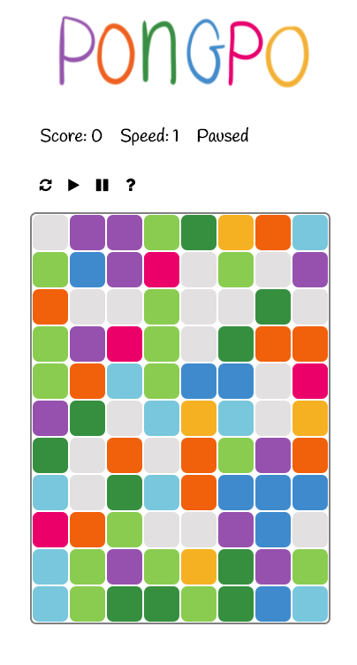
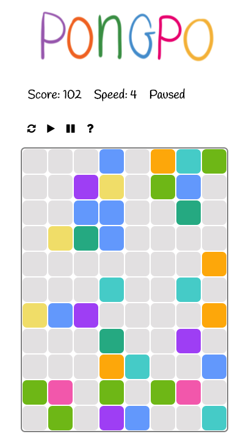
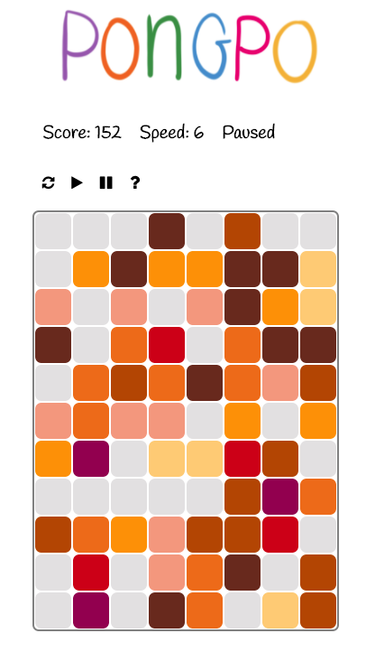
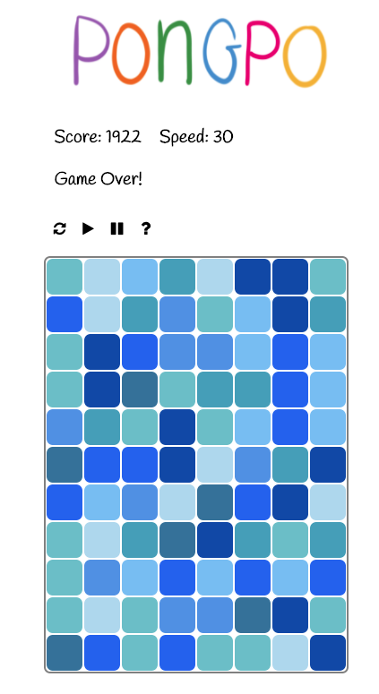

# Pongpo

[Live](http://antpensi.com/pongpo)

Pongpo is a simple but addictive game where you compete against time for a high score, and see what stage you can reach. To score points, the player must click on an open intersection of two squares of the same color. New squares are added as time goes on, and the rate at which new squares are added also increases. Clicking an incorrect intersection will cause a jump in speed.


## Gameplay

Pongpo starts with a partially filled grid of eight different colors.



To earn points and progress through the stages, you must click a blank square that is at the intersection of two like-colored squares.



Each stage has a unique color scheme.



Some more challenging than others. The game ends when the grid is completely filled.




## Implementation

Pongpo is built with vanilla JavaScript and jQuery. Three classes control all the logic and rendering, `Game`, `Board`, and `Square`.

`Game` is in charge of the player's score, the game's speed, rendering the grid, and telling the board to handle moves or switch palettes.

`Board` stores the grid as a variable of `Square` objects. It is in charge of figuring out what squares need to be removed, as well as if there are any valid moves to be made.

`Square` handles rendering list elements with the correct colors for a given stage.

## Interesting Snippets

The bulk of the game's logic lies in figuring out what squares were hit by a player's move, and what needs to be removed. Once the squares that are hit is calculated, that can be passed through to helper functions that do the computation.

```ruby
sameColorSquares(squares) {
  let colorCount = {};
  for (let i = 0; i < squares.length; i++) {
    if (!squares[i]) continue;

      if (colorCount[squares[i].color]) {
        colorCount[squares[i].color].push(squares[i]);
        } else {
          colorCount[squares[i].color] = [squares[i]];
        }
      }
      return colorCount;
}

removeSameColorSquares(colorCount, real=true) {
  const colors = Object.keys(colorCount);
  let foundMatch = false;
  for (let i = 0; i < colors.length; i++) {
    if (colorCount[colors[i]].length > 1) {
      for (let j = 0; j < colorCount[colors[i]].length; j++) {
        if (real) {
          colorCount[colors[i]][j].makeBlank();
          this.score += (1 * this.stage);
        }
        foundMatch = true;
      }
    }
  }
  if (foundMatch) {
    return 1;
  } else {
    return -1;
  }
}
```

`sameColorSquares` is responsible for returning a hash with keys of colors pointing to an array of squares of that color.

`removeSameColorSquares` can then take this hash and look at each values length. If it's greater than one, those squares need to be removed (`.makeBlank()`). This function returns 1 or -1 based on whether or not matches were present. This is utilized in other parts of the game when determining if valid plays remain on the grid.
